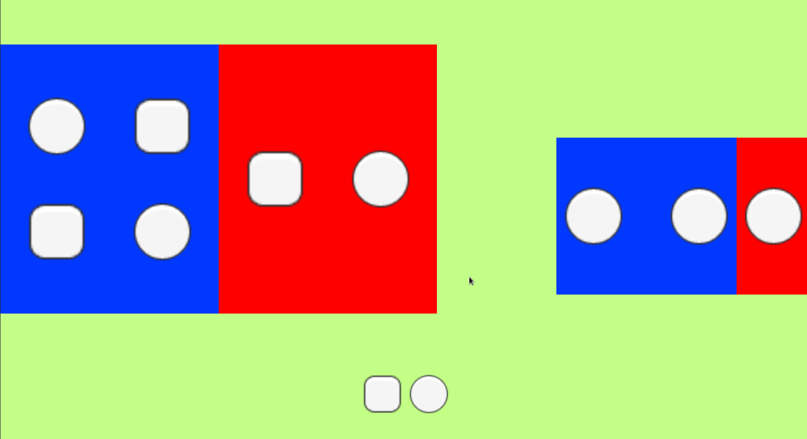
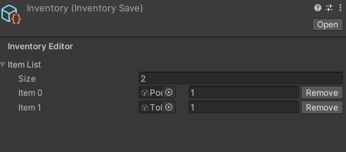
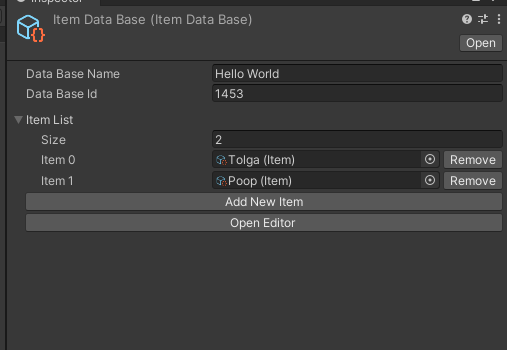
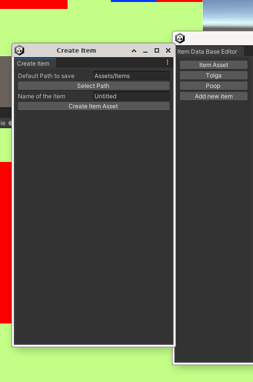
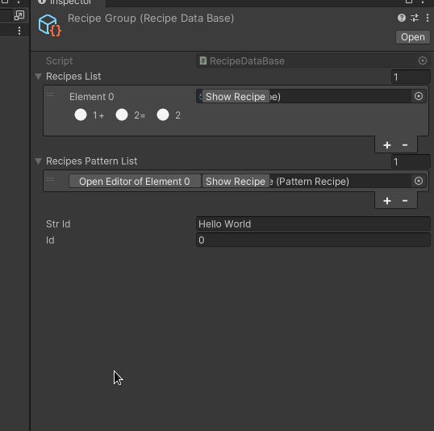
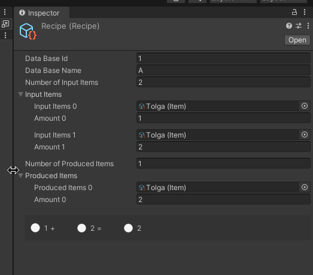
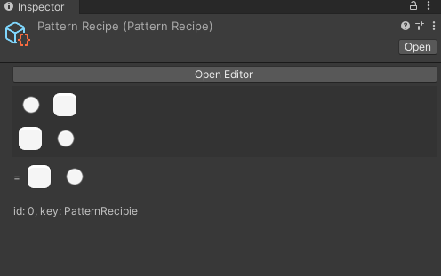
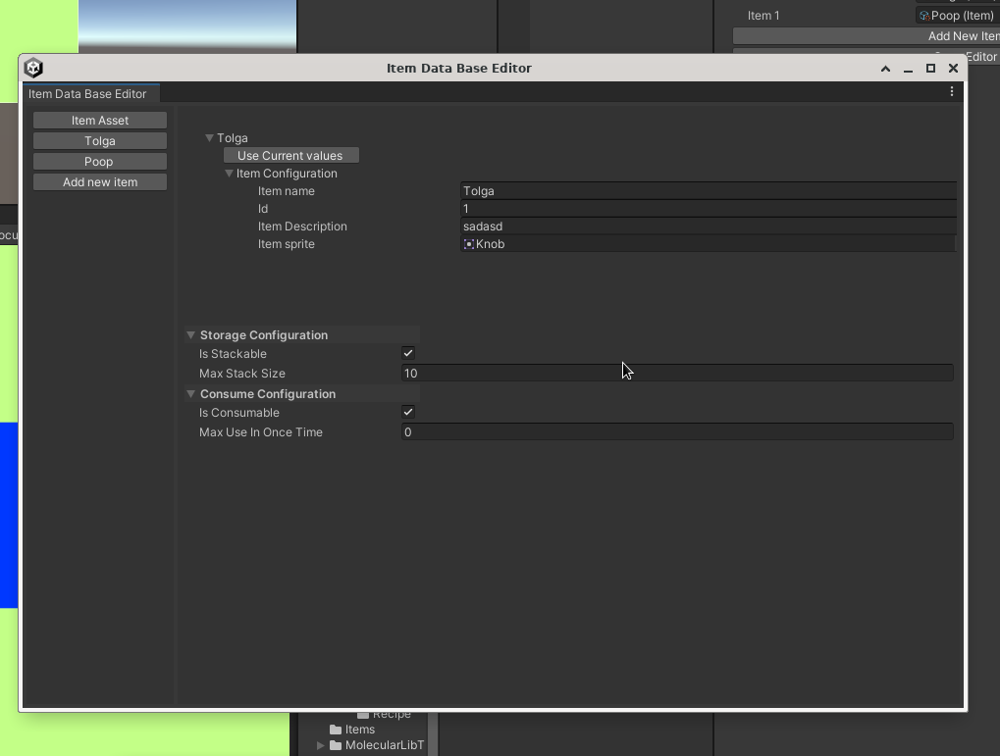

# Inventory System with Molecular Library

## Overview

This repository contains an inventory management system implemented in Unity, 
utilizing the Molecular Library for enhanced functionality. 
The system features customizable item slots, recipe handling, and a grid-based layout for efficient item organization. 
This framework is designed to help game developers manage and manipulate inventory items. Hope You will like it.

## Features

- Customizable item slots
- Recipe management for item crafting
- Grid-based layout for item organization
- Integration with the Molecular Library

## Sample Images
<div style="display: flex; flex-wrap: wrap; justify-content: space-around;">
    
    
    
    
    
    
    
    
</div>

## Getting Started

To get started with the Inventory System, follow these steps:

1. Clone the repository to your local machine:
   ```bash
   git clone https://github.com/yourusername/InventorySystemWithMolecularLib.git
   ```
2. Open the project in Unity.
3. Set up the necessary prefabs and assets for your inventory system.
4. Start implementing and customizing the inventory system to fit your game's needs.

## Included Tests

This repository also includes tests for the Molecular Library components located in the `Assets/MolecularLibTests/Scripts` directory. Below is a brief overview of the test scripts included:

- **HelpersTest**: Tests for helper functions and utilities.
- **Polymorphic**: Tests for polymorphic behaviors and functionalities.
- **SerializableDictionary**: Tests for the SerializableDictionary implementation.
- **TimersTest**: Tests for timer functionalities within the system.
- **VolatileScriptableObjectTest**: Tests for Volatile Scriptable Object behaviors.
 
## License

Feel free to use in any case

## Credits

This project utilizes the **Molecular Library**, developed by [Heymity](https://github.com/Heymity). Their work has provided a solid foundation for building and extending the inventory system.

